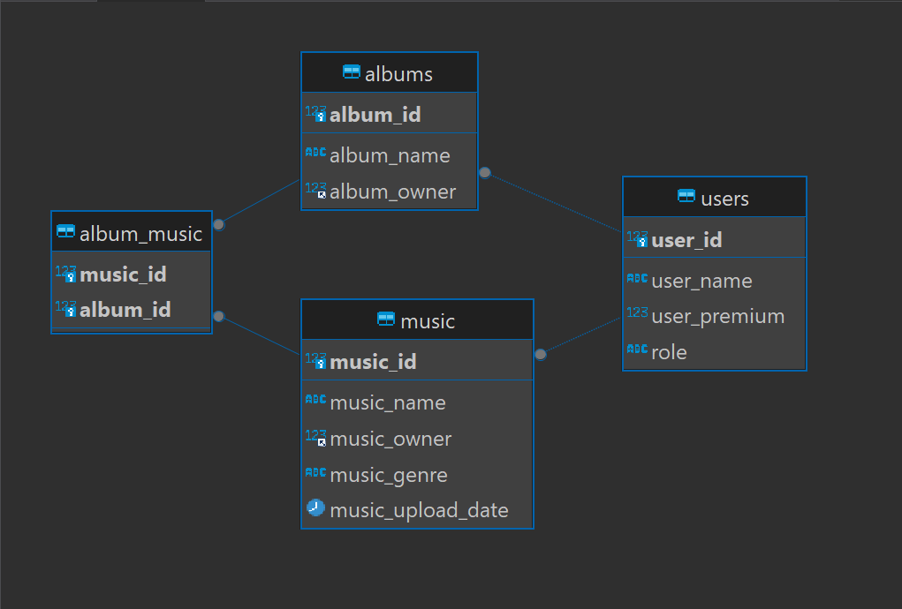

# Sevenify - REST

## Deskripsi REST Web Service
REST atau Representational State Transfer merupakan arsitektur komunikasi berbasis web yang berkomunikasi menggunakan protokol HTTP (Hypertext Transfer Protocol). Pada REST web service, setiap komponen pada sisten dianggap sebagai resource atau sumber daya yang dapat diakses melalui URIs (Universal Resource Identifiers). Resource tersebut direpresentasikan dalam bentuk format teks, JSON atau XML. Interaksi dengan resorce dapat dilakukan melalui HTTP request seperti GET, POST, PUT, DELETE.

## Cara Instalasi
1. Pastikan _requirements_ sudah terinstall pada perangkat Anda
2. Buka terminal
3. Lakukan clone repository ini : `git clone https://github.com/Rinaldy-Adin/sevenify-rest.git`
4. Setup file .env menggunakan contoh pada .env.example
5. Pindah ke directory repository: `cd sevenify-rest`
6. Install dependencies project dengan npm: `npm install`
7. Jalankan PHP service
8. Jalankan REST service: `npm start`

## Skema Basis Data 

## Endpoint API
Endpoint login : `/login`  
Endpoint akses admin daftar pending user join: `/admin/pending`  
Endpoint akses admin user join request by  ID: `/admin/pending/:user_id`  
Endpoint daftar album : `/album`  
Endpoint album by ID : `/login/:album_id`  
Endpoint daftar music : `/music`  
Endpoint music by ID : `/music/:music_id`  

## Pembagian Tugas
Backend Fungsi Authentication : 13521134  
Backend Fungsi Admin : 13521134  
Backend Fungsi Album : 13521077, 13521134  
Backend Fungsi Music : 13521134  

## Kontributor
10023174 Ilham Syam 
13521077 Husnia Munzayana 
13521134 Rinaldy Adin 
